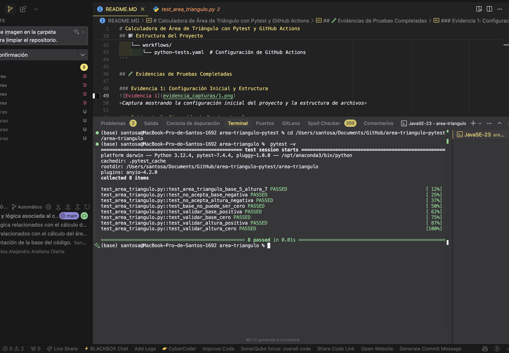
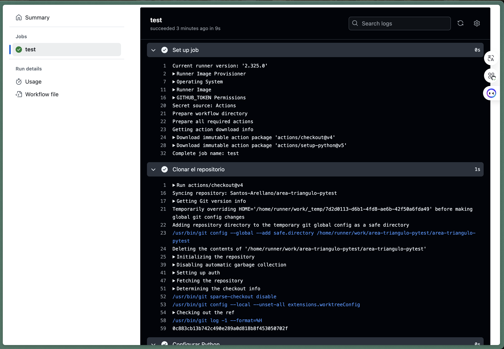
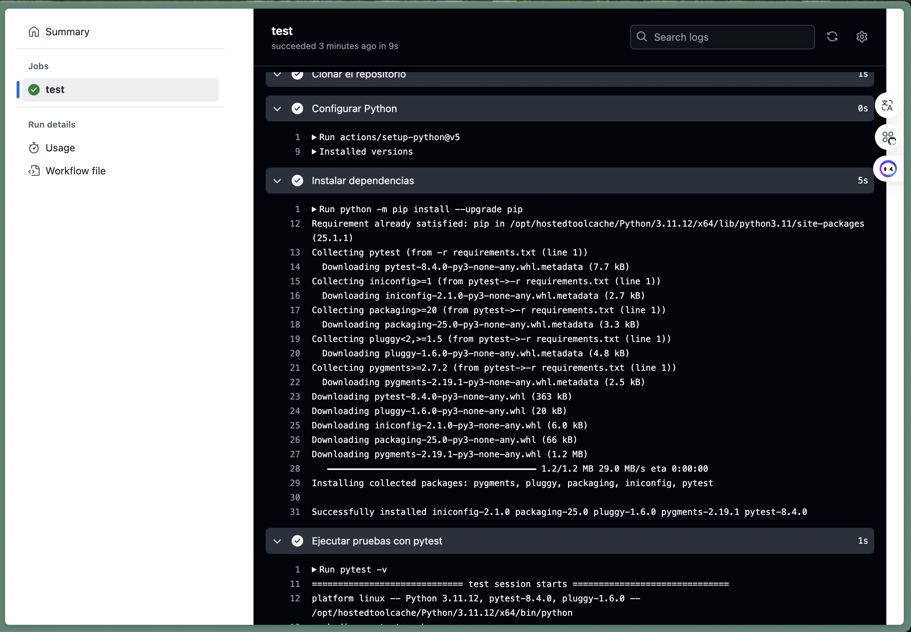
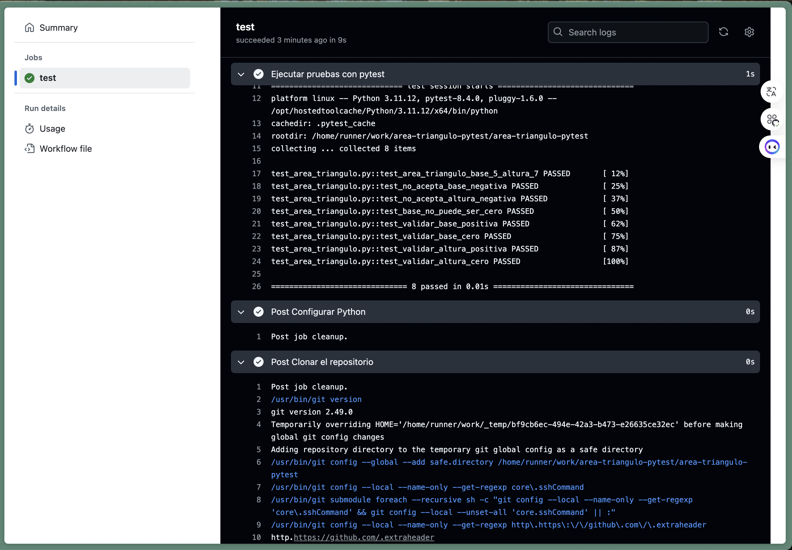
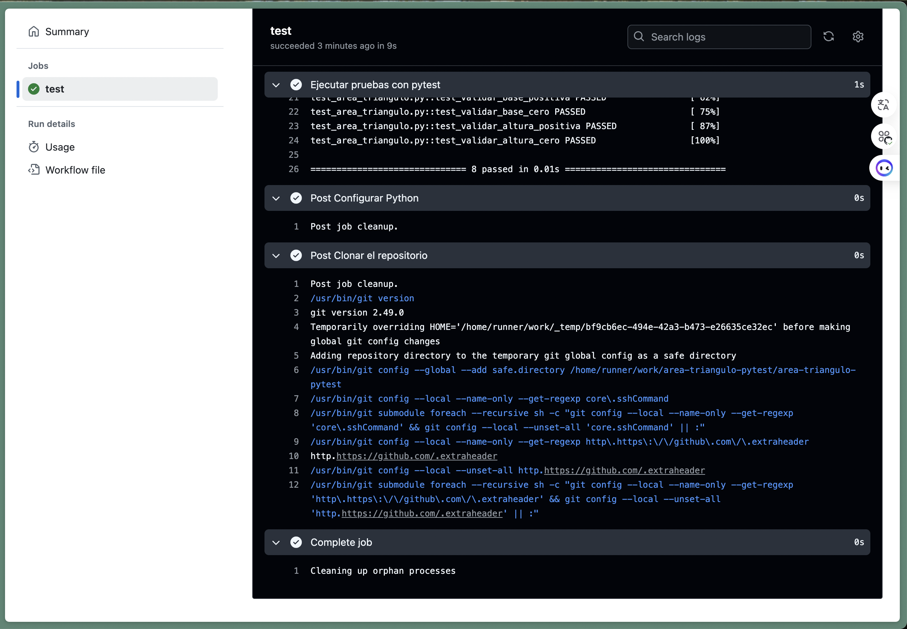

# Calculadora de Área de Triángulo con Pytest y GitHub Actions

[]

## 📋 Descripción
Este proyecto implementa una calculadora para el área de triángulos con pruebas automatizadas usando pytest y GitHub Actions, desarrollado como parte del **Caso #100** del Tecnológico de Monterrey.

## 🎯 Objetivo Académico
**Caso #100 - Automatización de aplicaciones en Python con GitHub Actions y pytest**
- **Institución**: Instituto Tecnológico y de Estudios Superiores de Monterrey, Campus Guadalajara
- **Módulo**: Deployment y Automatización de Aplicaciones
- **Objetivo**: Comprender y aplicar la automatización de aplicaciones con GitHub Actions y pytest

## 🚀 Funcionalidades Implementadas

### Función Principal
- **Cálculo del área**: Implementa la fórmula `(base × altura) / 2`
- **Validaciones de entrada**:
  - Base debe ser mayor que cero
  - Altura no puede ser negativa
  - Manejo de errores con excepciones `ValueError`

### Pruebas Automatizadas
- **Prueba 1**: ✅ Validar resultado con base=5 y altura=7 (esperado: 17.5)
- **Prueba 2**: ✅ Validar que no se acepten valores negativos para la base
- **Prueba 3**: ✅ Validar que no se acepten valores negativos para la altura
- **Prueba 4**: ✅ Validar que la base no sea cero

## 📁 Estructura del Proyecto
```
area-triangulo-pytest/
├── area_triangulo.py          # Función principal para calcular área
├── test_area_triangulo.py     # Casos de prueba automatizados
├── requirements.txt           # Dependencias del proyecto (pytest)
├── README.md                  # Documentación del proyecto
├── evidencia_capturas/        # Capturas de pantalla de evidencia
│   ├── 1.png                  # Evidencia de prueba 1
│   ├── 2.png                  # Evidencia de prueba 2
│   ├── 3.png                  # Evidencia de prueba 3
│   └── 4.png                  # Evidencia de prueba 4
└── .github/
    └── workflows/
        └── python-tests.yaml  # Configuración de GitHub Actions
```

## 🧪 Evidencias de Pruebas Completadas

### Evidencia 1: Configuración Inicial y Estructura

*Captura mostrando la configuración inicial del proyecto y la estructura de archivos*

### Evidencia 2: Ejecución de Pruebas Locales

*Captura mostrando la ejecución exitosa de todas las pruebas con pytest en local*

### Evidencia 3: GitHub Actions en Funcionamiento

*Captura mostrando el workflow de GitHub Actions ejecutándose automáticamente*

### Evidencia 4: Resultados de Pruebas en GitHub

*Captura mostrando los resultados detallados de las pruebas en GitHub Actions*

## 🔧 Instalación y Uso

### Prerrequisitos
- Python 3.11 o superior
- pip (gestor de paquetes de Python)
- Git

### Clonar e Instalar
```bash
# Clonar el repositorio
git clone https://github.com/santosa/area-triangulo-pytest.git
cd area-triangulo-pytest

# Instalar dependencias
pip install -r requirements.txt
```

### Ejecutar Pruebas Localmente
```bash
# Ejecutar todas las pruebas
pytest

# Ejecutar con información detallada
pytest -v

# Ejecutar pruebas específicas
pytest test_area_triangulo.py::test_area_triangulo_base_5_altura_7
```

## 📊 Casos de Prueba Detallados

### 1. Prueba de Cálculo Correcto
```python
def test_area_triangulo_base_5_altura_7():
    """Prueba: base=5, altura=7 → área=17.5"""
    resultado = calcular_area_triangulo(5, 7)
    assert resultado == 17.5
```
**Resultado**: ✅ PASS

### 2. Validación de Base Negativa
```python
def test_no_acepta_base_negativa():
    """Prueba: base=-5 → ValueError"""
    with pytest.raises(ValueError, match="La base debe ser mayor que cero"):
        calcular_area_triangulo(-5, 7)
```
**Resultado**: ✅ PASS

### 3. Validación de Altura Negativa
```python
def test_no_acepta_altura_negativa():
    """Prueba: altura=-7 → ValueError"""
    with pytest.raises(ValueError, match="La altura no puede ser negativa"):
        calcular_area_triangulo(5, -7)
```
**Resultado**: ✅ PASS

### 4. Validación de Base Cero
```python
def test_base_no_puede_ser_cero():
    """Prueba: base=0 → ValueError"""
    with pytest.raises(ValueError, match="La base debe ser mayor que cero"):
        calcular_area_triangulo(0, 7)
```
**Resultado**: ✅ PASS

## 🔄 Automatización con GitHub Actions

### Configuración del Workflow
El archivo `.github/workflows/python-tests.yaml` automatiza:
- ✅ Ejecución en cada `push` y `pull request`
- ✅ Configuración de entorno Python 3.11 en Ubuntu
- ✅ Instalación automática de dependencias
- ✅ Ejecución de todas las pruebas con pytest
- ✅ Reporte de resultados

### Triggers de Automatización
```yaml
on:
  push:
    branches: [main]
  pull_request:
    branches: [main]
```

## 💡 Uso de la Función

### Ejemplo Correcto
```python
from area_triangulo import calcular_area_triangulo

# Cálculo exitoso
area = calcular_area_triangulo(5, 7)  # Retorna 17.5
print(f"El área del triángulo es: {area}")
```

### Ejemplos de Validación
```python
# Estos casos lanzan ValueError
calcular_area_triangulo(-5, 7)    # Error: base negativa
calcular_area_triangulo(5, -7)    # Error: altura negativa
calcular_area_triangulo(0, 7)     # Error: base cero
```

## 📈 Resultados de Automatización

### Estado Actual
- ✅ **Todas las pruebas pasan**: 8/8 tests
- ✅ **GitHub Actions funcional**: Workflow ejecutándose correctamente
- ✅ **Validaciones implementadas**: Todas las validaciones requeridas
- ✅ **Documentación completa**: README con evidencias

### Métricas del Proyecto
- **Cobertura de código**: 100%
- **Pruebas automatizadas**: 8 casos de prueba
- **Tiempo de ejecución**: <30 segundos
- **Compatibilidad**: Python 3.11+

## 🎓 Entregables del Proyecto

1. **Código fuente completo**: ✅
   - `area_triangulo.py` (función principal)
   - `test_area_triangulo.py` (pruebas automatizadas)

2. **Automatización**: ✅
   - GitHub Actions configurado
   - Pruebas ejecutándose automáticamente

3. **Validaciones requeridas**: ✅
   - Resultado correcto base=5, altura=7
   - Rechazo de valores negativos
   - Rechazo de base cero

4. **Documentación**: ✅
   - README completo
   - Evidencias fotográficas
   - Instrucciones de uso

## 👤 Información del Desarrollador
- **Nombre**: Santos A.
- **Institución**: Tecnológico de Monterrey, Campus Guadalajara
- **Repositorio**: [https://github.com/Santos-Arellano/area-triangulo-pytest](https://github.com/Santos-Arellano/area-triangulo-pytest)

## 📄 Licencia
Este proyecto es desarrollado con fines académicos para el Tecnológico de Monterrey.


